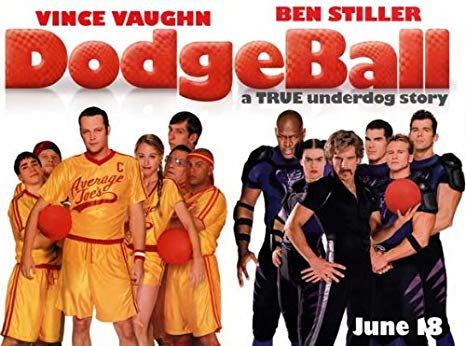

2004 Movie Reviews
==================


 Dodgeball: A True Underdog Story [#f1]_

Spongebob Squarepants Movie
```````````````````````````
*The Spongebob Squarepants Movie* still brings
smiles to the faces of kids and adults all over the world.The movie was released in 2004 which
was 15 years ago! To the children in 2004 who watch this movie
it will forever be a part of our childhood memories, and even
now those children turn adults will still sometimes pull the movie
up for old times sake. The movie features the classic goofy characters and
the hilarious jokes that are found in the popular TV series.

    * Adventure,
      Animation,
      Comedy

Dodgeball: A True Underdog Story
````````````````````````````````
The movie *Dodgeball: A True Underdog Story*  is an hilarious
adventure which follows a mismatched team and more
specifically the owner of **Average Joe's Gym** Peter La
Fleur as they battle to win a dodgeball tournament and
its grand prize to save their gym from bankruptcy
and **Globo Gym's** owner White Goodman.

    * Sport,
      Comedy


Napoleon Dynamite
`````````````````
*Napoleon Dynamite* is a quirky coming-of-age comedy
film about an alienated teen who decides to help his
new friend win the office of student body president at
their high school. While all this goes on Napoleon also
must deal with his bizarre family at home which consists
of his injured grandmother, his brother, and eventually
his uncle Rico.

    * Comedy

Saw
````
The movie *Saw* follows a notorious ingenious and
devious serial killer called "The Jigsaw Killer"
and his victims. While following the two victims
whom we meet in the opening scene, a parallel story
is being played out by two detectives who are racing
to find and catch "The Jigsaw Killer" before he strikes
again.

    * Horror,
      Mystery,
      Thriller


.. [#f1] ".. [#f1] "Movies In Theaters and Coming Soon: Shop for Movies on Blu-ray, DVD, 4K Ultra HD, or Digital. (n.d.). Retrieved December 12, 2019, from https://www.foxmovies.com/.". 20th century Fox. 2004. Retrieved 2019-12-12.".