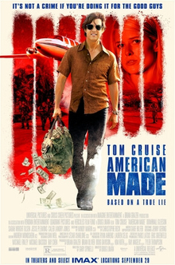

2017 Movies
=============

+-----------+----------+--------+
|Movies     |Genres    |Rating  |
+===========+==========+========+
|Get Out    |Mystery/  |R       |
|           |Thriller  |        |
+-----------+----------+--------+
|Spider-Man |Fantasy/  |PG-13   |
|Homecoming |Sci-Fi    |        |
+-----------+----------+--------+
|Jumanji    |Fantasy/  |PG-13   |
|           |Action    |        |
+-----------+----------+--------+
|American   |Drama/    |R       |
|Made       |Crime     |        |
+-----------+----------+--------+

Get Out
--------
.. figure:: getout.PNG

**Get Out** [#f1]_

    * Now that Chris (Daniel Kaluuya) and his girlfriend, Rose (Allison Williams),
      have reached the meet-the-parents milestone of dating, she invites him for a
      weekend getaway upstate with Missy and Dean, her parents. At first, Chris reads
      the family's overly accommodating behavior as nervous attempts to deal with their
      daughter's interracial relationship, but as the weekend progresses, a series of
      increasingly disturbing discoveries lead him to a truth that he never could have
      imagined.

This film holds some scary, yes realistic events, which is why I think viewers have
been so engaged and intrigued with it. As Chris is a young black man in America, he
faces a scary encounter with a crazed racist white family. After a series of events
takes place that catch his attention, it seems as though an escape is already too late.
When the families plan unfolds, he is caught between life and death. The only thing
holding him back is the Rose’s hypnotist mother. Straight Thriller!

Spider-Man Homecoming
----------------------
.. figure:: homecoming.PNG

**Spider-Man Homecoming** [#f2]_

   * Thrilled by his experience with the Avengers, young Peter Parker returns home to live
     with his Aunt May. Under the watchful eye of mentor Tony Stark, Parker starts to embrace
     his new found identity as Spider-Man. He also tries to return to his normal daily routine
     of being a normal high school student.  Though he is distracted by thoughts of proving
     himself to be more than just a friendly neighborhood superhero. Peter must soon put his
     powers to the test when the evil Vulture emerges to threaten everything that he holds dear.

Played by Tom Holland, the Peter Parker of this firm is exactly what the Marvel Universe
needed. He plays the part perfectly and instantly gains a faithful audience. The movie
is both humorous and action-packed, keeping the viewer engaged the whole time. Definitely
a great late-night flick and will keep the viewer wanting more. Should be an exciting
series for the future!

Jumanji
--------
.. figure:: jumanji.PNG

**Jumanji** [#f3]_

   * When Spencer goes back into the fantastical world of Jumanji, pals Martha, Fridge and Bethany re-enter
     the game to bring him home. But everything about Jumanji is about to change, as they soon discover more
     obstacles and more danger to overcome.

This film is a great nighttime movie for laughs with the family. The cast does a great job playing their
parts and keeping the audience engaged. Full of catchy one-liners and hysterical events. Great for all ages
and a must see!

American Made
---------------

**American Made** [#f4]_

    * Barry Seal, a TWA pilot, is recruited by the CIA to provide reconnaissance on the burgeoning communist
      threat in Central America and soon finds himself in charge of one of the biggest covert CIA operations
      in the history of the United States. The operation spawns the birth of the Medellin cartel and almost
      brings down the Reagan White House.

Based off real events, this movie is more than interesting. Not satisfied with his current life, Tom Cruise
does a great job portraying a character that makes his way to the top. Evading the feds, this film will keep
you locked in and on the edge of your seat. The journey of a criminal is never easy, especially on this level.

.. [#f1] "`<https://en.wikipedia.org/wiki/Get_Out#/media/File:Get_Out_poster.png>`_". Wikipedia. 2017. Retrieved 2019-12-11.
.. [#f2] "`<https://en.wikipedia.org/wiki/Spider-Man:_Homecoming#/media/File:Spider-Man_Homecoming_poster.jpg>`_". Wikipedia. 2017. Retrieved 2019-12-11.
.. [#f3] "`<https://en.wikipedia.org/wiki/Jumanji:_Welcome_to_the_Jungle#/media/File:Jumanji_Welcome_to_the_Jungle.png>`_". Wikipedia. 2017. Retrieved 2019-12-11.
.. [#f4] "`<https://en.wikipedia.org/wiki/American_Made_(film)#/media/File:American_Made_(film).jpg>`_". Wikipedia. 2017. Retrieved 2019-12-11.
