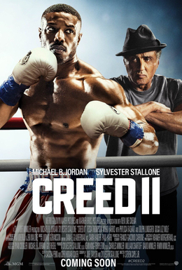

2018 Movies
=============

+----------+----------+--------+
|Movies    |Genres    |Rating  |
+==========+==========+========+
|Avengers  |Fantasy/  |PG-13   |
|Infinity  |Sci-Fi    |        |
|War       |          |        |
+----------+----------+--------+
|Creed II  |Drama/    |PG-13   |
|          |Sport     |        |
+----------+----------+--------+
|Halloween |Slasher/  |R       |
|          |Thriller  |        |
+----------+----------+--------+
|The Black |Fantasy/  |PG-13   |
|Panther   |Sci-Fi    |        |
+----------+----------+--------+

Avengers Infinity War
----------------------
.. figure:: infinitywar.PNG

**Avengers Infinity War** [#f1]_

   * In this firm, the Avengers unite to battle their most powerful enemy yet, the evil Thanos.
     On a mission to collect all six Infinity Stones, Thanos plans to use the artifacts to inflict
     his twisted will on reality. With all six stones, just the snap of his fingers can wipe out
     half of all existence in the universe. The fate of the planet and existence itself has never
     been more uncertain as everything the Avengers have fought for has led up to this moment.

Throughout the film, we see Thanos go on his reign of terror, going planet by planet until he
gets all the stones. With a combination of over 20 Marvel film characters, we see all the heroes
of the Marvel Universe take part in trying to stop him. This film is action-packed and will keep
you on the edge of your seat till the end. The movie ends on a major cliffhanger and leaves what
remains of the Avengers to pick up the pieces in a later film. (Avengers Endgame) It’s an
amazing 2-part series!

Creed II
---------

**Creed II** [#f2]_

    * In 1985, Russian boxer Ivan Drago killed former U.S. champion Apollo Creed in a tragic match that stunned
      the world. In this film, against the wishes of trainer Rocky Balboa, we see Apollo's son Adonis Johnson
      accepts a challenge from Drago's son. Drago’s son is another dangerous, upcoming fighter. Under guidance
      from Rocky, Adonis trains for the showdown of his life. This fight seems to be a date with destiny that
      soon becomes his obsession. Now, Johnson and Balboa must confront their shared legacy as the past comes
      back to haunt each man.

Throughout the film, we see the usual rise, fall, then rise again plot. This time the implications and
excitement are heightened due to the dramatic events that have taken place before this. (Rocky IV and Creed I).
Adonis Johnson has quickly made his way to the top of the fighting world. We see him challenge Drago’s son
more than once and make his way back to the top. This film really puts the grit and determination of a fighter
into perspective.

Halloween
----------
.. figure:: halloween.PNG

**Halloween** [#f3]_

   * It's been 40 years since Laurie Strode survived a vicious attack from crazed killer Michael Myers on Halloween
     night. Locked up in an institution, Myers manages to escape when his bus transfer goes horribly wrong. Laurie
     now faces a terrifying showdown when the masked madman returns to Haddonfield, Illinois. This time, she's ready for him.

This film is the sequel of all sequels, as we see Michael Myers attempt to finish the job. The murders that he
commits in the film are not only gruesome, but meticulous. It seems that the main character in the movie is Laurie
Strode’s granddaughter, as the film tends to revolve around her. In an epic finish, we see all the characters in
the same house, fighting for survival. By far the best Halloween movie yet!

The Black Panther
------------------
.. figure:: blackpanther.PNG

**The Black Panther** [#f4]_

   * After the death of his father, T'Challa returns home to the African nation of Wakanda to take his
     rightful place as king. That is, until a powerful enemy suddenly reappears. T'Challa's faces adversity
     in trying to claim his throne as king, and as Black Panther. His destiny gets tested when he's drawn
     into a conflict that puts the fate of Wakanda and the entire world at risk. Faced with treachery and
     danger, the young king must rally his allies and release the full power of Black Panther to defeat
     his foes and secure the safety of his people.

Throughout the film, we see a plot unfold where the Black Panther must rise to the occasion. T’Challas’s
father had a mistress during his life and fathered an unknown son, Erik Killmonger. Now with him dead,
Killmonger believes he has a right to compete for the throne. Though the movie is exciting, Killmonger
doesn’t’ necessarily have any powers. He is a former special-forces operative and is persistent in his
work. Doesn’t seem like much of a challenge for a super hero, but hey it’s never good to assume. Still
a good flick overall.

.. [#f1] "`<https://en.wikipedia.org/wiki/Avengers:_Infinity_War#/media/File:Avengers_Infinity_War_poster.jpg>`_". Wikipedia. 2018. Retrieved 2019-12-11.
.. [#f2] "`<https://en.wikipedia.org/wiki/Creed_II#/media/File:Creed_II_poster.png>`_". Wikipedia. 2018. Retrieved 2019-12-11.
.. [#f3] "`<https://en.wikipedia.org/wiki/Halloween_(2018_film)#/media/File:Halloween_(2018)_poster.jpg>`_". Wikipedia. 2018. Retrieved 2019-12-11.
.. [#f4] "`<https://en.wikipedia.org/wiki/Black_Panther_(film)#/media/File:Black_Panther_film_poster.jpg>`_". Wikipedia. 2018. Retrieved 2019-12-11.