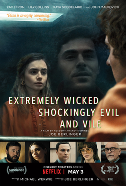

2019 Movies
=============

+-----------+----------+--------+
|Movies     |Genres    |Rating  |
+===========+==========+========+
|Avengers   |Fantasy/  |PG-13   |
|Endgame    |Sci-Fi    |        |
+-----------+----------+--------+
|Joker      |Drama/    |R       |
|           |Thriller  |        |
+-----------+----------+--------+
|Spider-Man |Fantasy/  |PG-13   |
|Far from   |Sci-Fi    |        |
|Home       |          |        |
+-----------+----------+--------+
|Extremely  |Drama/    |R       |
|Wicked,    |Crime     |        |
|Shockingly |          |        |
|Evil, and  |          |        |
|Vile       |          |        |
+-----------+----------+--------+

Avengers Endgame
----------------
.. figure:: endgame.PNG

    **Avengers Endgame** [#f1]_

   * Avengers Endgame is the sequel to Avengers Infinity War. The movie is a
     culmination of a decade of blockbuster film making. This is supposed to be the
      most blockbuster of all the blockbusters, a movie with a dozen subplots colliding,
      and familiar faces from over 20 other Marvel movies.

   * After the disappointing Avengers: Infinity War ending where Thanos finally got all
     of the six Infinity Stones he so desperately sought after and used them to wipe out
      half of existence, including beloved heroes like Black Panther, Star-Lord, and Spider-Man,
      Endgame picks up a few weeks after The Snap. As the story continues, the remaining heroes
      try to pick up the pieces and figure out if there is a way to reverse Thanos destruction.
      Thanks to Thanos, throughout the film we see a smaller, more close-knit Avenger squad
      highlighted by less prominent heroes than we have seen before like Ant-Man and Hawkeye.

The film is more patient and focused than previous Marvel films. As a viewer, I was engaged and
interested THE WHOLE TIME. As the movie concludes and the plot unfolds, we have the pleasure of
finally witnessing the ultimate battle between the Good and Evil forces of the universe. Without
giving away any major spoilers, the most satisfying part of the movie is that rather than the
Avengers being left behind in a sea of chaos, the popular ones are left glorified. Major players
like Iron Man and Captain America are left with a sense of being larger than life characters for a
generation. All in all, this movie is easily one of the best movies of the year. After living up to
the hype, it is a must watch. (After Infinity War of course.)

Joker
------
.. figure:: joker.PNG

    **Joker** [#f2]_

   * Played by Joaquin Phoenix, Arthur Fleck is a failed comedian feeling alone in a crowd and seeking
     connection as he walks the streets of Gotham City. Isolated, bullied and disregarded by society,
     Fleck begins a slow descent into madness as he transforms into the criminal mastermind known as
     the Joker.

From the jump we see a film that is dark and disturbing. Fleck is seen as invisible to the outside
world, which is justifiable. He has some obvious issues as he seeks therapy and medication to cope.
Along with that, he is a person who most avoid on the streets. He isnt particularly funny and has an
irresistible tendency to burst out laughing in uncomfortable situations, which makes other uncomfortable
or scared that he may do something dangerous. Starting with almost nothing, he quickly loses it all and
blames the world. It doesnt take long for him to realize killing people who make him feel bad it turn
makes him feel better.

All in all, the movie was a tad slow and dark for me personally. I envisioned the Joker being someone
who was radically violent and committing crime ingeniously. Throughout this movie we see a character develop
without those things. This is mainly a back story with a few murders. He doesnt seem to have the wit or
personality to pull off the acts of a typical Joker. With that being said, we do find out he is the son to
Thomas Waynes mistress. Thomas Wayne is the richest man in Gotham, who also rejects him, and is the father
of Bruce Wayne. Though he is a kid in this film, Bruce Wayne is notoriously known for being Batman, super
hero and arch nemesis to the Joker. Overall, I feel this movie didnt live up to the hype because the Joker
himself didnt live up to his known expectations. The film does end on a climactic scene and plausible
cliffhanger. Therefore, I believe that it may in fact be a good back story and prequel for future films,
though it could use more action and violence.

Spider-Man Far from Home
-------------------------
.. figure:: farfromhome.PNG

    **Spider-Man Far from Home** [#f3]_

    * Spider-Man Far from Home takes place after the events of Avengers: Endgame. In the first Marvel movie after
      Endgame, Tom Holland as Peter Parker and his classmates return to school in a post-“snap” world. As Peter
      and his pals prepare for a school trip to Europe, Nick Fury (Samuel L. Jackson), Maria Hill (Cobie Smulders),
       and what's left of S.H.I.E.L.D. investigate a bizarre "storm with a face". With many heroes taking a break
      from action, a new hero has come to the rescue. This character is Quentin Beck (Jake Gyllenhaal), a mysterious
      human from a parallel universe who's later dubbed Mysterio. Before Peter's European trip, Happy (Jon Favreau)
      gives him a special inheritance from the late Tony Stark, EDITH. EDITH is a billion-dollar tech embedded
       pair of sunglasses made by Tony. While in Venice, Fury tracks Peter down and commands him to help Mysterio
      fight the storm. All Peter really wants to do is confess his love to MJ and try to move forward as a
      "friendly neighborhood" superhero after all of the Endgame drama. In turn he gives up his control of
      EDITH and ends up in bigger trouble than he ever imagined.

This film is both humorous and heartfelt. It is an action-packed film with a great plot. Along with that, Tom
Holland does an amazing job playing the Amazing Spider-man. All in all, this film won’t leave you disappointed.
It’s a must see!

Extremely Wicked, Shockingly Evil, and Vile
---------------------------------------------

    **Extremely Wicked, Shockingly Evil, and Vile** [#f4]_

    * This film is a chronicle of the crimes of Ted Bundy from the perspective of Liz, his longtime girlfriend, who
      refused to believe the truth about him for years. Played by Zac Efron, the movie highlights the mysterious
      murders of many women that Bundy encounters. Throughout the entire film, Bundy maintains his irresistible charm
      and endlessly pleads his innocence. He is such a convincing character that even in times of no doubt, Liz
      questions if he actually did. Numerous times on the run, the movie leaves the viewer not only wanting answers,
      but wanting more.

Efron does a great job playing the character of Bundy. He immolates Ted’s traits and behaviors to a T.
Throughout the film he is a very impressive young man, very capable of gaining the attention of women.
Based on true events, the movie really puts the life of the serial killer into perspective. With that
being said, the movie isn’t much of a thriller. It doesn’t do a good job of showing how the murders went
down; whether that is a knock or not is up to you. Nonetheless, a pretty good flick overall!

.. [#f1] "`<https://en.wikipedia.org/wiki/Avengers:_Endgame#/media/File:Avengers_Endgame_poster.jpg>`_". Wikipedia. 2019. Retrieved 2019-12-11.
.. [#f2] "`<https://en.wikipedia.org/wiki/Joker_(2019_film)#/media/File:Joker_(2019_film)_poster.jpg>`_". Wikipedia. 2019. Retrieved 2019-12-11.
.. [#f3] "`<https://en.wikipedia.org/wiki/Spider-Man:_Far_From_Home#/media/File:Spider-Man_Far_From_Home_poster.jpg>`_". Wikipedia. 2019. Retrieved 2019-12-11.
.. [#f4] "`<https://en.wikipedia.org/wiki/Extremely_Wicked,_Shockingly_Evil_and_Vile#/media/File:Extremely_Wicked,_Shockingly_Evil,_and_Vile_poster.png>`_". Wikipedia. 2019. Retrieved 2019-12-11.